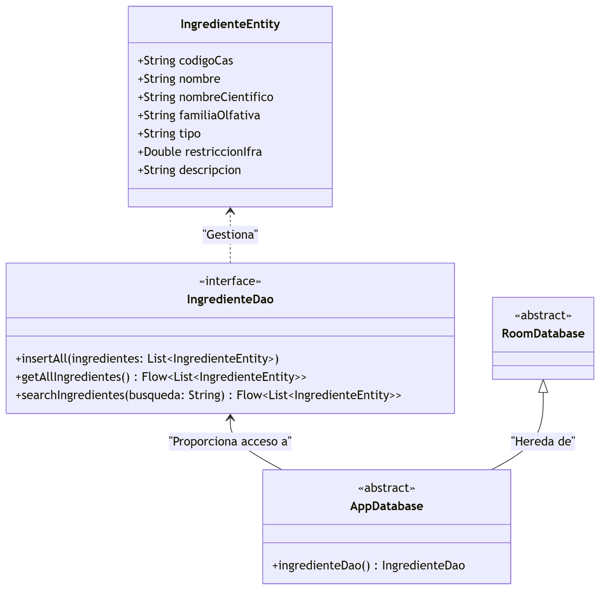
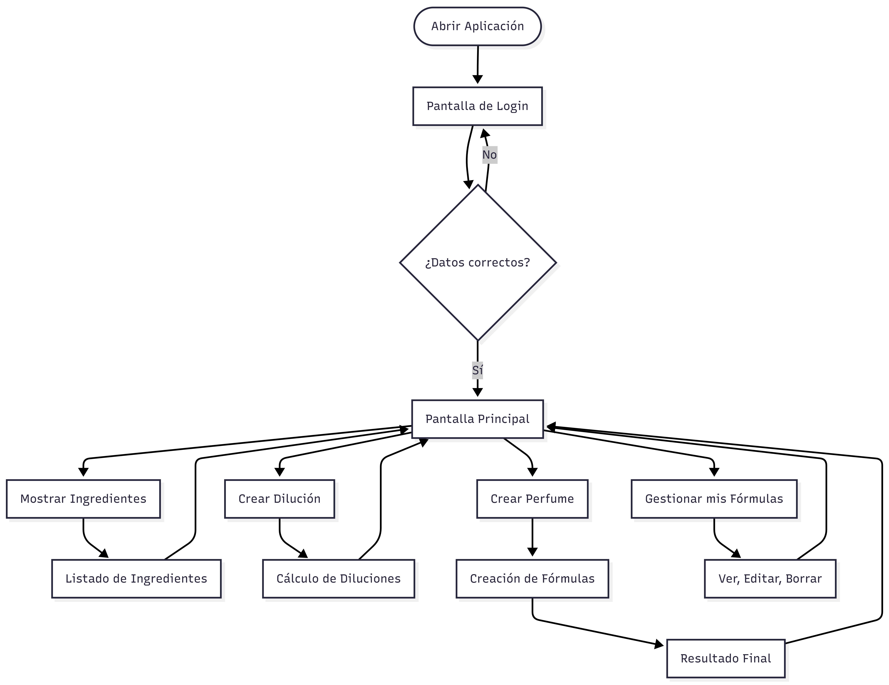

# TFE-PerfumeryApp-Showcase
Showcase TFE: App Android nativa (Kotlin + Compose) para formulación en perfumería. Arquitectura MVVM, Room, Firebase y Seguridad Biométrica E2EE.

# FormuLab - Sistema Avanzado de Formulación de Perfumería

**FormuLab** es una aplicación móvil nativa para Android orientada a la optimización del flujo de trabajo de perfumistas independientes y estudiantes de formulación. El sistema automatiza el cálculo de diluciones, gestiona bases de datos de materias primas y permite el diseño estructurado de fórmulas olfativas bajo altos estándares de seguridad.

> **Aviso de Propiedad Intelectual:** El presente repositorio funciona exclusivamente como un portfolio técnico (Showcase). El código fuente original es de carácter privativo y se mantiene en un entorno cerrado, dado que el software se encuentra en fase de pre-comercialización. Estoy a disposición para realizar revisiones de arquitectura y demostraciones de código durante procesos de selección o entrevistas técnicas.

## Funcionalidades Principales

* **Gestión de Materias Primas:** Motor de base de datos local para la consulta eficiente de cientos de ingredientes, indexados por código CAS, familia olfativa y restricciones regulatorias (IFRA).
* **Motor Algorítmico de Diluciones:** Módulo de cálculo preciso para la determinación de proporciones soluto/solvente en la rebaja de concentraciones.
* **Compositor Estructurado:** Herramienta de diseño de fórmulas basada en la pirámide olfativa tradicional (notas de salida, corazón y fondo) con cálculo automático de concentraciones finales (EDC, EDT, EDP).
* **Autenticación Biométrica:** Integración de la API BiometricPrompt para restringir el acceso a la sección privada de fórmulas mediante hardware (huella dactilar/reconocimiento facial).
* **Criptografía (E2EE):** Implementación de cifrado de extremo a extremo para garantizar el secreto industrial de las fórmulas almacenadas en la nube.

## Arquitectura y Stack Tecnológico

El proyecto ha sido desarrollado aplicando los principios de **Clean Architecture** y el patrón de diseño **MVVM (Model-View-ViewModel)** recomendado en las directrices oficiales de Android.

* **Desarrollo Nativo:** Kotlin (SDK 28+).
* **Interfaz de Usuario (UI):** Jetpack Compose (UI Declarativa).
* **Persistencia de Datos (Local):** Room (SQLite) implementando deserialización de carga inicial con GSON.
* **Persistencia de Datos (Cloud):** Cloud Firestore (Base de datos NoSQL orientada a documentos).
* **Gestión de Identidad:** Firebase Authentication integrado con Google Single Sign-On (SSO).
* **Concurrencia y Asincronía:** Kotlin Coroutines y flujos reactivos (StateFlow/Flow).

## Documentación Técnica y Visual

## Licencia y Derechos de Autor

**Copyright © 2026 Elida María Diez Gómez. Todos los derechos reservados.**

Este repositorio, incluyendo su documentación, esquemas de diseño (UI/UX), modelo de datos y arquitectura descrita, no se distribuye bajo ninguna licencia de código abierto. Queda estrictamente prohibida la reproducción, distribución, modificación, copia o uso comercial de cualquier elemento expuesto en este proyecto sin la autorización expresa, previa y por escrito de la autora.
